# How to programm your nRF52840 Dongle (MacOS only)

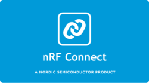 


---
## Table of Contents

- [Description](#description)
- [Equipment](#technologies)
- [How To Use](#how-to-use)
- [License](#license)
- [Author Info](#author-info)

---

## Description

This instruction will teach you how to programm your nRF52840 using only nRF Connect, nRF_SDK and Visual Studio Code. This instruction is for MacOS only!!!.
    
---

## Equipment

- nRF 52840 Dongle
- MacOS
- Visual Studio Code 

[Back To The Top](#read-me-template)

---
## How To Use
#### ARN GNU TOOLCHAIN Installation
- Download ***gcc-arm-none-eabi-9-2019-q4-major-mac.tar.bz2*** from this repository and unzip it

- Make a place to install it to
```
    mkdir /usr/local/gcc_arm
```    
- Move the unzipped file
```
mv ~/Downloads/gcc-arm-none-eabi-9-2019-q4-major /usr/local/gcc_arm/
```
- Peep your current PATH
```
echo $PATH
```
- Change your PATH by appending the "bin" folder of the folder
```
export PATH="$PATH:/usr/local/gcc_arm/gcc-arm-none-eabi-9-2019-q4-major/bin/"
```
- Check the version of gcc-arm firmware compiler to ensure that is avaiable
```
arm-none-eabi-gcc --version
```
- If everything is okey you should see this message

***arm-none-eabi-gcc (GNU Tools for ARM Embedded Processors) your_version (release) [ARM/embedded-4_7-branch revision 202601]***


#### nRF Connect Installation

- Download ***nrfconnect330.dmg*** from this repository or from Nordic website ***https://www.nordicsemi.com/Software-and-Tools/Development-Tools/nRF-Connect-for-desktop***

- Install it on your computer

- Open it

- Install Programmer

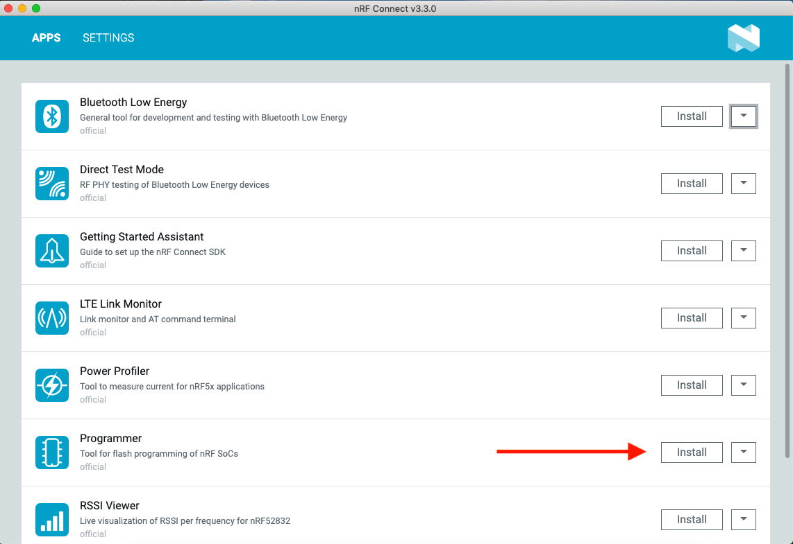

- Your nRF Connect is ready for work


#### SDK Installation

- Download ***nRF5_SDK_16-2*** from this repository or from Nordic website ***https://www.nordicsemi.com/Software-and-Tools/Software/nRF5-SDK***

- Unzip it and save it anywhere you want

- Open the folder and go to 
```
cd /nRF5_SDK_16-2/components/toolchain/gcc
```

- Open ***Makefile.posix*** wiht TextEdit or different text editor (like nano)

- Edit it likes this

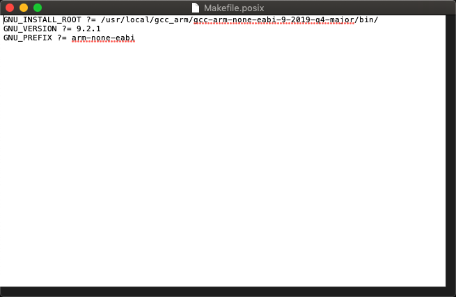

- Save it 

##### Porgramming your Dongle with blinky

- Open ***nRF5_SDK_16-2*** in Visual Studio Code

- Go to ***/examples/peripheral/blinky*** and open ***main.c***
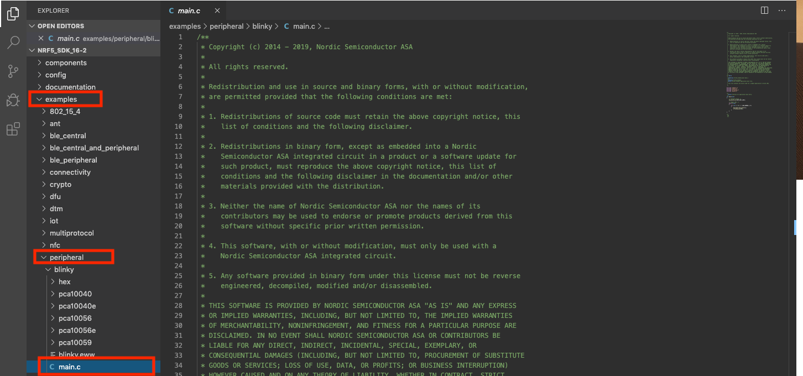

- Here is your code, for the blinky app. You can change it, learn it, have fun with it

- To compile this file we are using Makefile

- Go to ***/examples/peripheral/blinky/pca10059*** and right click on armgcc

- Click on ***Open in Terminal***
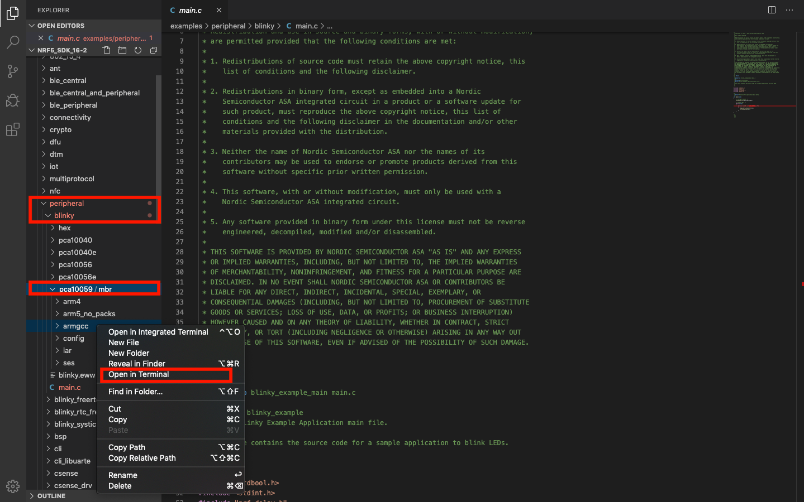

- On the bottom of Visual Studio Code you will see the terminal. Type there make command
```
make
```

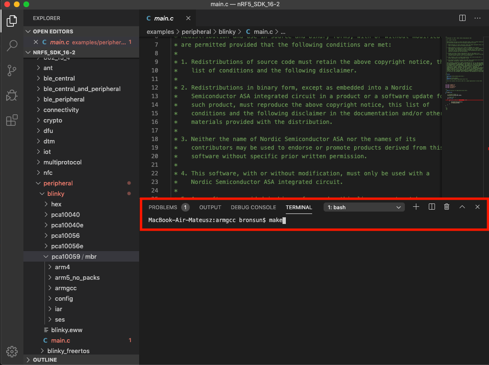

- Wait thew seconds. If you did everything right you should see this information

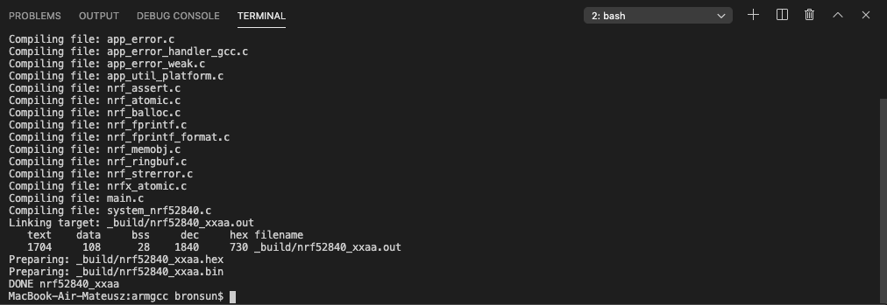

- Now you have generated hex file in ***/armgcc/_build/nrf52840_xxaa.hex*** 

- Open nRF Connect and the programmer

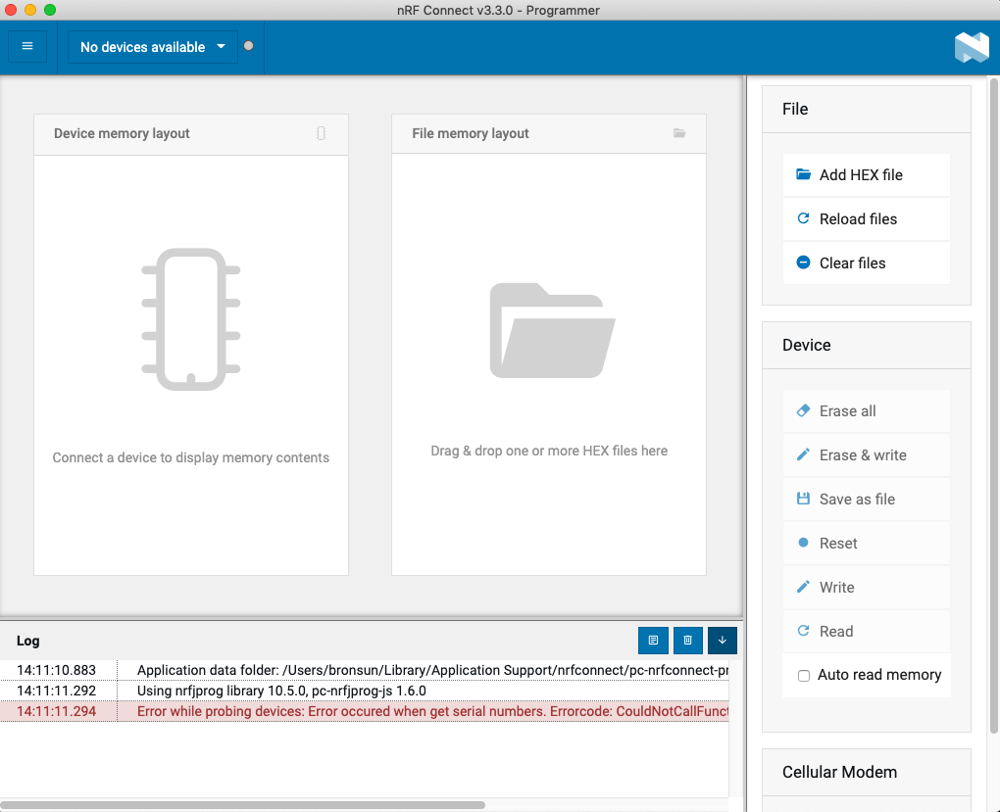

- Plug in your nRF52840 to your usb port and press reset button

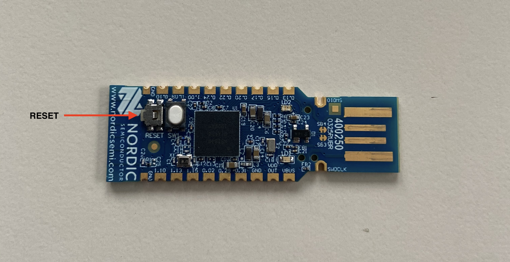

- You should see red LED blinking

- Click on Select device and choose your nRF52840 Donlge

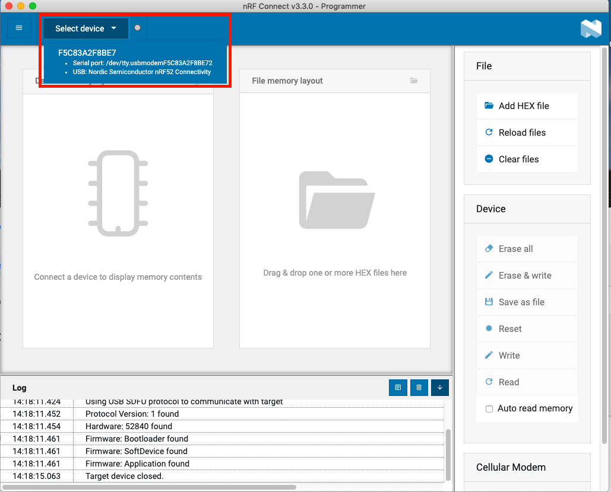

- Now we only have to add our SoftDevice and our hex file. Do this click on ***Add HEX file*** and go to ***/nRF5_SDK_16-2/components/softdevice/s140/hex/s140_nr52_7.0.1_softdevice.hex***

- Now you should see something like this in your programmer

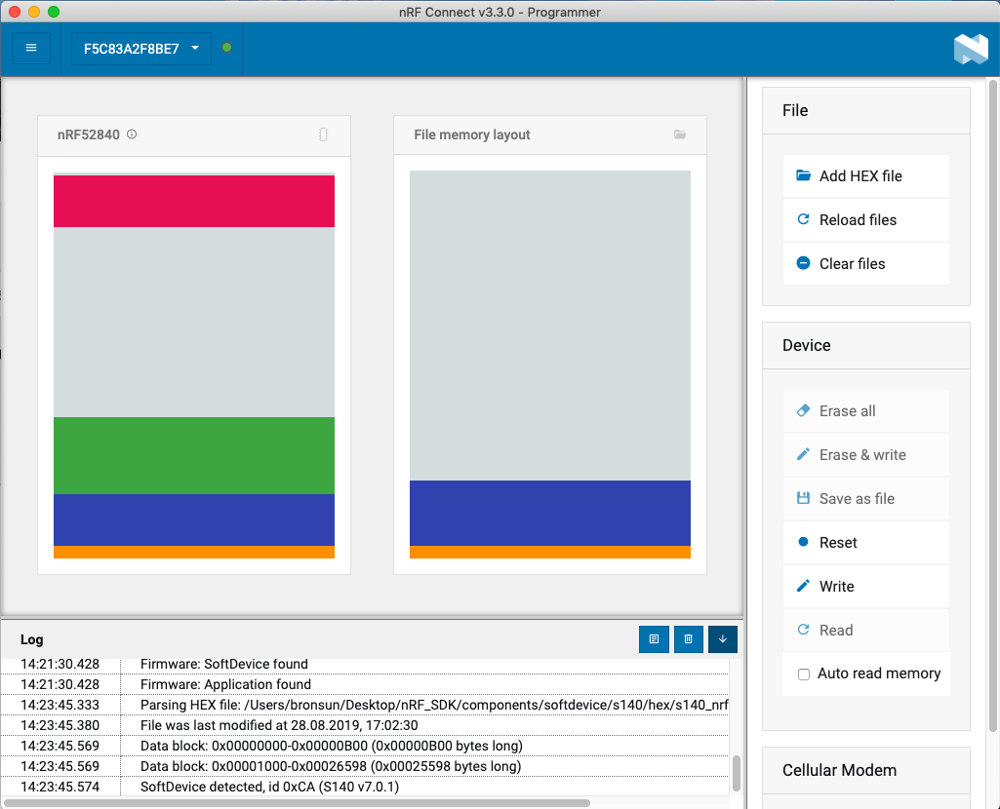

- Click again on ***Add HEX file*** and your generated HEX file from blinky app ***/nRF5_SDK_16-2/examples/peripheral/blinky/pca10059/armgcc/_build/nrf52840_xxaa.hex***

- Now you only have to click on ***write***

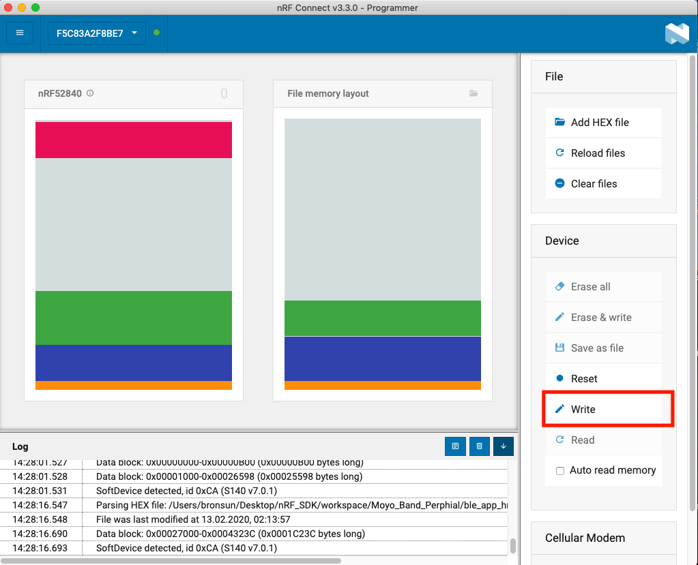


- Hurray you have programmed your first app on your nRF52840 Dongle

[Back To The Top](#read-me-template)


---

## License
All programs and copyrights belonges to Nordic Semiconductors. THIS IS ONLY AN INSTRUCTION and I have no rights to any of these  programms that are in this instruction. That is only for educational purpose.

Copyright (c) 2020, Nordic Semiconductor ASA

All rights reserved.

Redistribution and use in source and binary forms, with or without modification, are permitted provided that the following conditions are met:

Redistributions of source code must retain the above copyright notice, this list of conditions and the following disclaimer.

Redistributions in binary form, except as embedded into a Nordic Semiconductor ASA integrated circuit in a product or a software update for such product, must reproduce the above copyright notice, this list of conditions and the following disclaimer in the documentation and/or other materials provided with the distribution.

Neither the name of Nordic Semiconductor ASA nor the names of its contributors may be used to endorse or promote products derived from this software without specific prior written permission.

This software, with or without modification, must only be used with a Nordic Semiconductor ASA integrated circuit.

Any software provided in binary form under this license must not be reverse engineered, decompiled, modified and/or disassembled.

THE SOFTWARE IS PROVIDED "AS IS", WITHOUT WARRANTY OF ANY KIND, EXPRESS OR
IMPLIED, INCLUDING BUT NOT LIMITED TO THE WARRANTIES OF MERCHANTABILITY,
FITNESS FOR A PARTICULAR PURPOSE AND NONINFRINGEMENT. IN NO EVENT SHALL THE
AUTHORS OR COPYRIGHT HOLDERS BE LIABLE FOR ANY CLAIM, DAMAGES OR OTHER
LIABILITY, WHETHER IN AN ACTION OF CONTRACT, TORT OR OTHERWISE, ARISING FROM,
OUT OF OR IN CONNECTION WITH THE SOFTWARE OR THE USE OR OTHER DEALINGS IN THE
SOFTWARE.

[Back To The Top](#read-me-template)

---

## Author Info
- LinkedIn - [Mateusz Broncel](https://www.linkedin.com/in/mateusz-broncel-339921149/)
- Facebook - [Mateusz Broncel](https://www.facebook.com/profile.php?id=100002577283334)
- Nordic - (https://www.nordicsemi.com)

[Back To The Top](#read-me-template)
